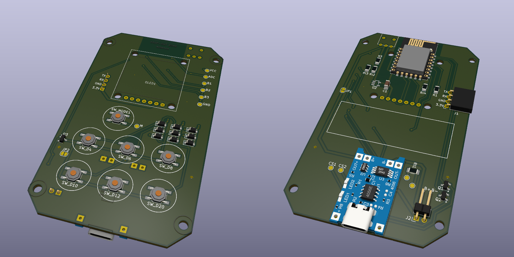

# Dice-Roller

Electronic dice roller. Firmware is not entirely implemented and there are still some problems, but it is in a usable state already.

Case designed in FreeCAD 1.0 preview version.

This repo is not very well documented, so if you are actually interested in building this and having trouble making sense of it - feel free to contact me

## Building firmware

* Install platformio
* Download dependencies: `git submodule update --init`
* Apply `firmware/lib/Adafruit-GFX-Library.patch` to `firmware/lib/Adafruit-GFX-Library`
  * The OLED display is installed upside-down on the PCB, and this patch includes a horrible hack to flip the text.
* Build firmware using platformio: `pio run -e v2`

## Screenshots

