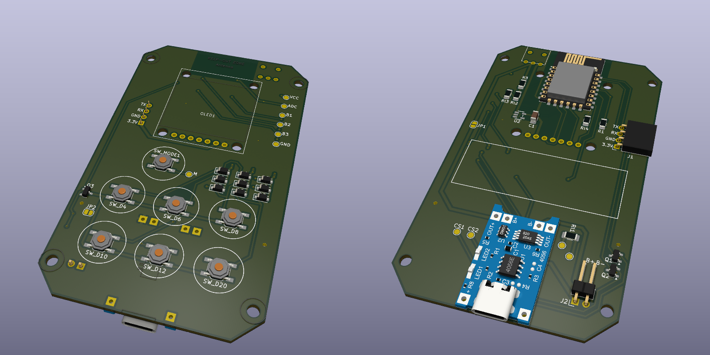
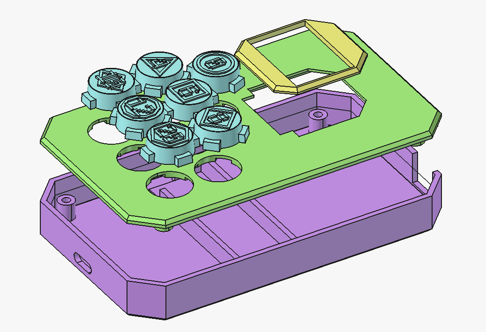

# Dice-Roller

Electronic dice roller for all the dice rolling needs. Includes d4, d6, d8, d10, d12 and d20.

Partially implemented:
* Battery display (currently shows raw analog pin input, without converting it to voltage or %)
* d100 / percentile dice (can be done by holding down d10 button, but is has not been finished and currently does not work correctly)

This repository contains two PCB versions - v1 and v2.
* v1 has been built and tested, but the kicad files have been lost. The recovered gerbers are in `dice-roller-pcb/v1-gerbers`.
* v2 is in the actual kicad project. It is meant to support battery charging status and persistent settings, but most of it is not implemented.

The firmware supports either version, selected via platformio environments

## Building firmware

* Install platformio
* Download dependencies: `git submodule update --init`
* Apply `firmware/lib/Adafruit-GFX-Library.patch` to `firmware/lib/Adafruit-GFX-Library`
  * The OLED display is installed upside-down on the PCB, and this patch includes a horrible hack to flip the text.
* Build firmware using platformio: `pio run -e v1` or `pio run -e v2`, depending on the target pcb version

Firmware is flashed via the UART header. To enable esp8266 flashing mode - hold the 0 button when booting

## Screenshots

